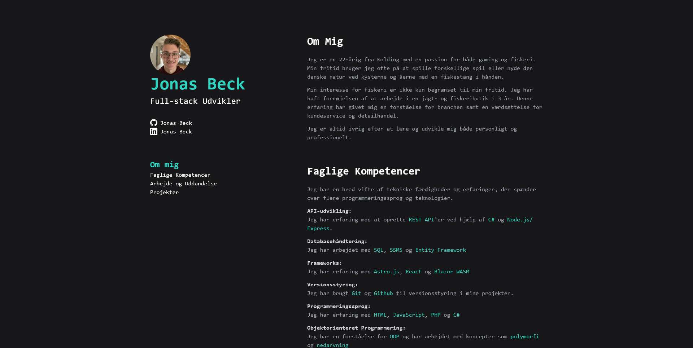

# Jonas Beck Portfolio



## Overview

My portfolio is developed using Astro.js, React, Tailwind CSS, and TypeScript. Its main purpose is to showcase my various projects, work experience, education, and certifications.

## Technologies Used

- **Astro.js**: A modern static site generator that enables fast and efficient websites.
- **React**: A JavaScript library for building user interfaces.
- **Tailwind CSS**: A utility-first CSS framework that helps in quickly building modern designs.
- **TypeScript**: A typed superset of JavaScript that enhances code quality and development experience.
- **Github Pages**: Static site hosting service by GitHub.
- **Github Actions**: Automated workflows for continuous integration and deployment.

## Features

- **About Me**: A section providing insights into who I am, my interests, and my motivation.
- **Skills Showcase**: An overview of technologies i have worked with.
- **Work and Education**: A timeline of my academic and professional journey 
- **Project Showcase**: Highlighting a selection of my best projects with descriptions and links.

## Getting Started

To run this project locally, follow these steps:

1. **Clone the Repository:**
   ```sh
   git clone https://github.com/Jonas-Beck/portfolio.git
    ```

2. **Install Dependencies and Generate Types:**
   ```sh
   cd portfolio
   npm install
   npx astro sync
    ```

3. **Run the Development Server:**
   ```sh
   npm run dev
    ```
    Open your browser and navigate to **'http://localhost:4321'** to view the portfolio

## Deployment

This portfolio is automatically deployed using GitHub Actions. Any changes pushed to the `main` branch will trigger the deployment workflow.
